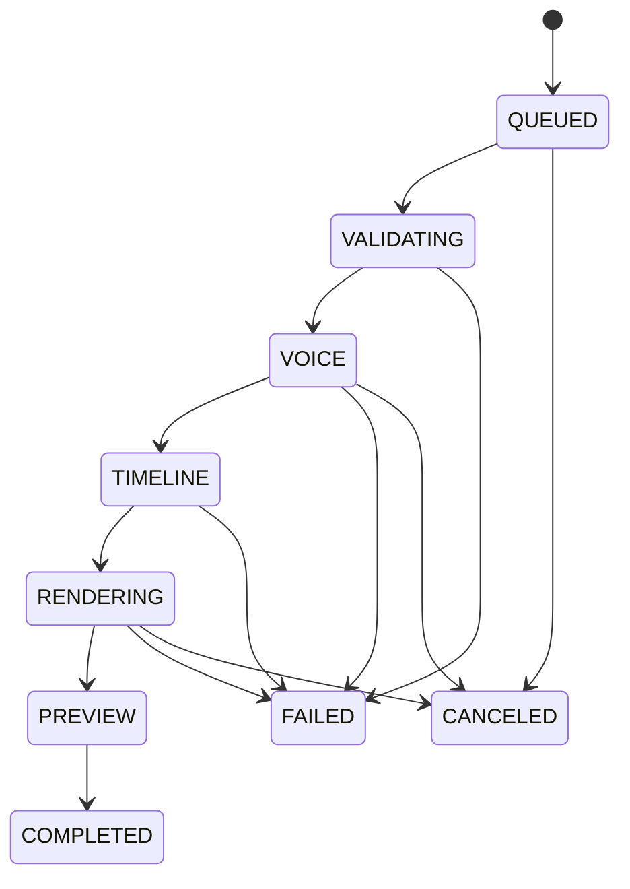

# Thiết kế luồng multi-job

## Trạng thái triển khai

- M2A — pipeline báo phase/progress: đã triển khai.
- M2B — SQLite queue, worker tuần tự, hủy/retry/recovery: đã triển khai, chờ nghiệm thu Windows.
- M2C — dashboard KPI/filter/checkbox/chi tiết/log: đã triển khai; worker OmniVoice sống lâu và cache cue vẫn ở backlog.
- M2D — render song song có giới hạn: chưa triển khai, chỉ thực hiện sau benchmark máy thật.

## Mục tiêu

Cho phép thêm nhiều gói dự án vào hàng đợi, đóng/mở lại app mà không mất danh sách, theo dõi riêng tiến độ và kết quả từng video. Bản đầu ưu tiên ổn định: nhiều job trong hàng đợi nhưng chỉ một job chạy tại một thời điểm.

## Vì sao chưa chạy song song ngay

- OmniVoice nạp model lớn lên GPU; nhiều process có thể hết VRAM hoặc làm chậm toàn bộ máy.
- Renderer và FFmpeg hiện dùng các tên file đầu ra cố định. Hai job dùng chung thư mục có thể ghi đè hoặc đọc nhầm file tạm.
- Tkinter chỉ được cập nhật widget từ main thread. Cho worker sửa UI trực tiếp dễ gây treo app.
- Hủy, retry và phục hồi sau khi app tắt cần trạng thái bền vững trước khi tăng concurrency.

Vì vậy multi-job không đồng nghĩa với chạy đồng thời. Mốc đầu là **queue tuần tự có thể phục hồi**.

## Mô hình job

Mỗi lần bấm thêm vào hàng đợi, app chụp một cấu hình bất biến:

| Trường | Ý nghĩa |
|---|---|
| `job_id` | UUID duy nhất |
| `project_source` | Đường dẫn manifest/gói nguồn |
| `project_hash` | Dấu vân tay dữ liệu tại lúc xếp hàng |
| `voice_profile_id` | Giọng đã chọn, không phụ thuộc lựa chọn UI về sau |
| `aspect_ratio` | `16:9`, `9:16` hoặc `1:1` |
| `pen_brand` | Chữ trên bút của job |
| `run_dir` | `output/runs/<job_id>/` riêng biệt |
| `created_at` | Thời điểm tạo job |

Không dùng lựa chọn hiện thời trên màn hình khi worker bắt đầu; worker chỉ đọc snapshot của job. Nhờ đó người dùng có thể mở dự án khác mà job đang chạy không bị đổi cấu hình.

## Trạng thái và pipeline



SQLite lưu job, phase hiện tại, phần trăm, lỗi và lịch sử sự kiện tại `%APPDATA%\NetChuyenDong\jobs.db`. Khi app khởi động lại, trạng thái đang chạy được đổi thành `INTERRUPTED`; người dùng có thể **Thử lại** từ phase cuối có artifact hợp lệ.

## Worker và tài nguyên

### Phiên bản đầu — đã triển khai

- Một `JobRunner` nền lấy job `QUEUED` lâu nhất.
- Một job chạy trọn pipeline rồi mới sang job tiếp theo.
- Worker gửi event vào queue; main thread Tkinter đọc event và cập nhật giao diện.
- Hủy job đặt cancel token, dừng tiến trình con có kiểm soát và không công bố `final.mp4` dở dang.

### OmniVoice

- Dùng một worker/service sống lâu để chỉ nạp model một lần.
- Chỉ một tác vụ TTS dùng GPU tại một thời điểm.
- Cache cue theo SHA-256 của phiên bản model, hash giọng mẫu, text chuẩn hóa, ngôn ngữ và thông số voice.
- Job retry dùng lại cue đã tạo hợp lệ, không sinh lại toàn bộ âm thanh.

### Render song song về sau

Chỉ mở sau khi đo VRAM, RAM, CPU và tốc độ ổ đĩa trên máy thật. Cấu hình dự kiến: một lane OmniVoice và tối đa một hoặc hai lane render. Mặc định vẫn là một job chạy để tránh làm máy mất phản hồi.

## Cô lập đầu ra và tính toàn vẹn

Mỗi job ghi vào:

```text
output/
└── runs/
    └── <job_id>/
        ├── audio-cues/
        ├── runtime-annotations/
        ├── timeline.json
        ├── voice-timeline.wav
        ├── preview.jpg
        ├── preview-audio.wav
        └── final.mp4
```

File đang tạo có hậu tố `.partial`; chỉ đổi tên nguyên tử thành tên chính thức sau khi bước đó hoàn tất. `latest.json` của dự án chỉ được cập nhật sau trạng thái `COMPLETED`, nên job lỗi hoặc bị hủy không thay video tốt trước đó.

## Giao diện dự kiến

- Thanh trên đổi giữa **Đơn nhiệm** và **Hàng đợi**.
- Bảng job: thứ tự, tên dự án, trạng thái, phase, tiến độ, thời lượng, kết quả.
- Thao tác: thêm nhiều dự án, đổi thứ tự job đang chờ, hủy, thử lại, mở thư mục kết quả.
- Chọn một dòng dùng màn hình hiện tại làm trang chi tiết: preview, kịch bản, cấu hình snapshot và log riêng.
- Job đang chạy vẫn tiếp tục khi người dùng xem job khác.

## Lộ trình triển khai

1. **M2A — Tách pipeline:** đã thêm progress theo command và giữ nguyên màn hình đơn nhiệm.
2. **M2B — Queue tuần tự:** đã thêm SQLite, `SequentialJobRunner`, dashboard và phục hồi job gián đoạn.
3. **M2C — Tối ưu voice:** đã có snapshot giọng và retry toàn job; worker OmniVoice sống lâu, cache cue và resume theo phase là bước tiếp theo.
4. **M2D — Concurrency có giới hạn:** benchmark máy thật rồi cho phép render song song bằng cấu hình, không chạy nhiều model voice.

## Tiêu chí nghiệm thu M2B

- Xếp 10 dự án và xử lý đúng thứ tự mà UI vẫn phản hồi.
- Tắt app giữa job, mở lại thấy đủ hàng đợi và có thể thử lại job bị gián đoạn.
- Xếp cùng một dự án hai lần không ghi đè kết quả của nhau.
- Hủy trong phase voice hoặc render không để lại `final.mp4` giả hoàn tất.
- Một gói lỗi chỉ làm job đó thất bại; các job sau vẫn tiếp tục.
- Log và preview luôn thuộc đúng job đang được chọn.
